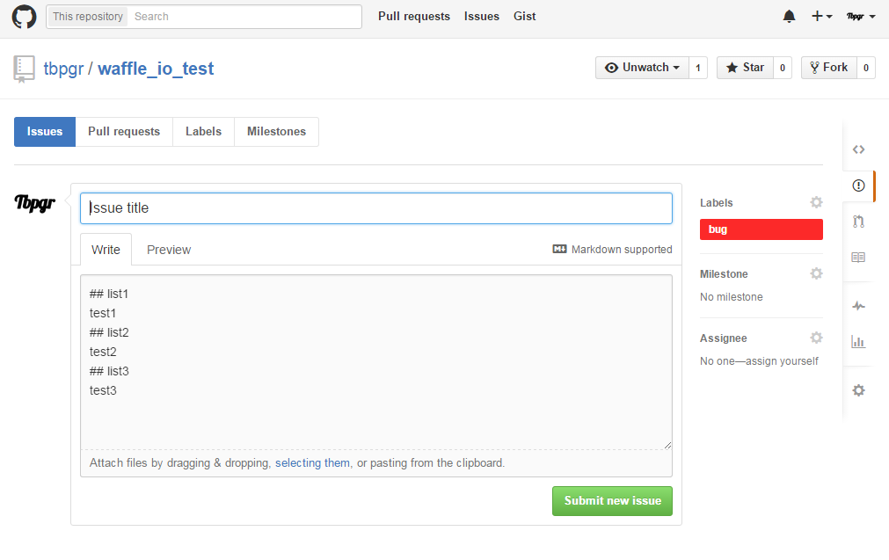

# Isstempl

Generate GitHub Issue template.

[](http://badge.fury.io/rb/isstempl)
[](https://travis-ci.org/tbpgr/isstempl)

## Installation

Add this line to your application's Gemfile:

```ruby
gem 'isstempl'
```

And then execute:

    $ bundle

Or install it yourself as:

    $ gem install isstempl

## Usage
### DSL
|name|value|example|memo|
|:--|:--|:--|:--|
|account|GitHub account|tbpgr|--|
|repository|GitHub Repository|issue_test|--|
|title|Issue title|some title|
|body|Issue body|some body|
|labels|IssueのLabels|bug|bug<br>duplicate<br>enhancement<br>help wanted<br>invalid<br>question<br>wontfix<br>or user defined Label|

### Commands
|command|description|
|:--|:--|
|init|generate DSL(Issuetmpl) tempalte.|
|generate|generate GitHub Issue template from Issuetmpl.|

## Sample
### Generate DSL(Issuetmpl) template
~~~bash
$ isstempl init
$ cat Isstempl
# encoding: utf-8

# GitHub Account
# account is required
# account allow only String
# account's default value => ""
account ""

# GitHub Repository
# repository is required
# repository allow only String
# repository's default value => ""
repository ""

# Issue Title
# title is required
# title allow only String
# title's default value => ""
title ""

# Issue Body
# body is required
# body allow only String
# body's default value => ""
body ""

# Issue Labels
# labels is required
# labels allow only String
# labels => bug / duplicate / enhancement / help wanted / invalid / question / wontfix / or user defined Label
# labels's default value => ""
labels ""
~~~

### Edit DSL(Issuetmpl)
~~~ruby
# encoding: utf-8

# GitHub Account
# account is required
# account allow only String
# account's default value => ""
account "tbpgr"

# GitHub Repository
# repository is required
# repository allow only String
# repository's default value => ""
repository "waffle_io_test"

# Issue Title
# title is required
# title allow only String
# title's default value => ""
title "Issue title"

# Issue Body
# body is required
# body allow only String
# body's default value => ""
body <<-EOS
## list1
test1
## list2
test2
## list3
test3
EOS

# Issue Labels
# labels is required
# labels allow only String
# labels => bug / duplicate / enhancement / help wanted / invalid / question / wontfix / or user defined Label
# labels's default value => ""
labels "bug"
~~~

### Generate GitHub Issue template
~~~bash
$ isstempl generate
https://github.com/tbpgr/waffle_io_test/issues/new?title=Issue%20title&body=%23%23%20list1%0Atest1%0A%23%23%20list2%0Atest2%0A%23%23%20list3%0Atest3%0A&labels=bug
~~~

### Confirm URL


## Contributing

1. Fork it ( https://github.com/tbpgr/isstempl/fork )
2. Create your feature branch (`git checkout -b my-new-feature`)
3. Commit your changes (`git commit -am 'Add some feature'`)
4. Push to the branch (`git push origin my-new-feature`)
5. Create a new Pull Request
